# 大语言模型(LLM)本地部署实验报告
项目公开可访问链接：
## 1. 项目概述

本项目旨在探索大语言模型(LLM)的本地部署方法及其性能表现。通过在云服务器环境中部署开源大模型，我们可以深入了解 LLM 的运行机制、资源需求和实际应用效果。本次实验选取了两个主流的中文大语言模型：ChatGLM3-6B 和 Qwen-7B-Chat 进行对比测试，通过一系列多领域的问题来评估它们在理解能力、创造力、逻辑推理和专业知识等方面的表现差异。

### 1.1 实验目标

- 掌握大语言模型在 CPU 环境下的部署方法
- 实现两个主流开源大模型的本地化部署
- 通过对比测试分析不同模型的性能特点和适用场景
- 深入理解大语言模型的推理过程和资源消耗情况

### 1.2 技术栈

- Python 3.10
- PyTorch (CPU 版本)
- Transformers 库
- ModelScope 平台
- Conda 环境管理

## 2. 平台搭建

本项目使用 ModelScope 平台提供的云服务器环境进行大模型部署。以下是平台搭建的详细步骤：

1. 访问 ModelScope 官网（https://www.modelscope.cn/home），点击右上角完成新用户注册。
2. 登录后进入首页，确认已绑定阿里云账号并获得免费云计算资源。
3. 启动 CPU 服务器实例，用于后续的模型部署。

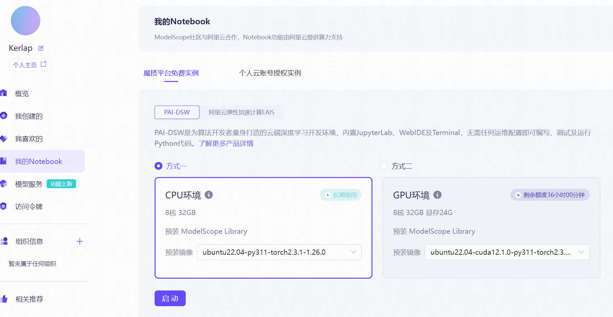

4. 进入个人主页，查看免费实例（CPU 环境）。
   - 注意：CPU 环境若 1 小时无操作将自动关闭，请及时保存工作进度。
5. 点击 Terminal 图标打开终端命令行环境，准备进行环境配置。

## 3. 环境搭建

### 3.1 conda 环境配置

由于大语言模型对环境依赖较为复杂，我们使用 Conda 创建独立的 Python 环境，以避免依赖冲突问题。

1. **手动安装 conda**（若 CPU 版本未预装）：

   ```bash
   cd /opt/conda/envs
   wget https://repo.anaconda.com/miniconda/Miniconda3-latest-Linux-x86_64.sh
   bash Miniconda3-latest-Linux-x86_64.sh -b -p /opt/conda
   echo 'export PATH="/opt/conda/bin:$PATH"' >> ~/.bashrc
   source ~/.bashrc
   conda --version
   ```

   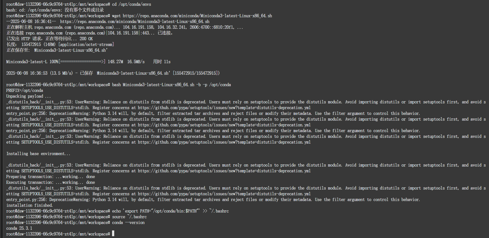

2. **创建并激活环境**：
   ```bash
   conda create -n qwen_env python=3.10 -y
   source /opt/conda/etc/profile.d/conda.sh
   conda activate qwen_env
   ```
   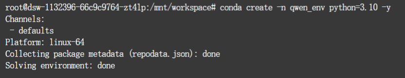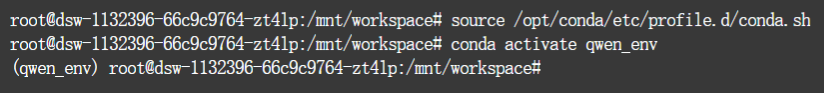

### 3.2 基础依赖安装

为了支持大模型的加载和推理，需要安装一系列依赖包，包括 PyTorch、Transformers 等核心库。

1. **检查 pip 联网状态并更新基础工具**：

   ```bash
   pip install -U pip setuptools wheel
   ```

2. **安装 PyTorch CPU 版本**：

   由于我们在 CPU 环境下运行，选择 PyTorch 的 CPU 版本可以减少不必要的 CUDA 依赖，提高兼容性。

   ```bash
   pip install \
   torch==2.3.0+cpu \
   torchvision==0.18.0+cpu \
   --index-url https://download.pytorch.org/whl/cpu
   ```

   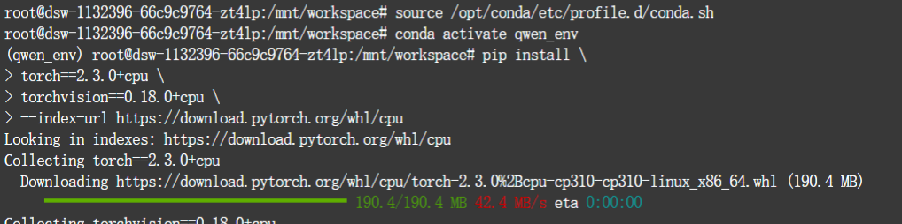

3. **安装兼容依赖包**：

   以下依赖包是运行大语言模型所必需的，包括模型加载、量化优化和推理加速等功能。

   ```bash
   pip install \
   "intel-extension-for-transformers==1.4.2" \
   "neural-compressor==2.5" \
   "transformers==4.33.3" \
   "modelscope==1.9.5" \
   "pydantic==1.10.13" \
   "sentencepiece" \
   "tiktoken" \
   "einops" \
   "transformers_stream_generator" \
   "uvicorn" \
   "fastapi" \
   "yacs" \
   "setuptools_scm"
   ```

   安装 fschat（需启用 PEP517 构建）：

   ```bash
   pip install fschat --use-pep517
   ```

   可选增强工具：

   ```bash
   pip install tqdm huggingface-hub
   ```

## 4. 大模型实践操作

### 4.1 下载大模型到本地

本实验选择了两个主流的开源中文大语言模型：ChatGLM3-6B 和 Qwen-7B-Chat。这两个模型都具有较好的中文理解能力，且在 CPU 环境下可以勉强运行。

1. **切换至数据目录**：

   ```bash
   cd /mnt/data
   ```

2. **下载模型**（分别下载两个模型）：
   ```bash
   # Qwen-7B-Chat
   git clone https://www.modelscope.cn/qwen/Qwen-7B-Chat.git
   # ChatGLM3-6B
   git clone https://www.modelscope.cn/ZhipuAI/chatglm3-6b.git
   ```

完成 git clone 相关 git 的截图或部署完成的相关截图:
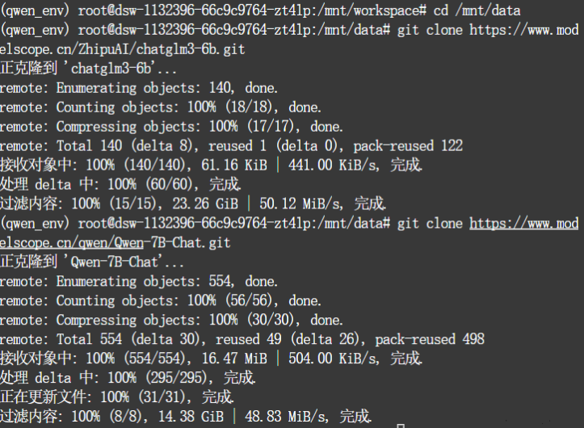
部署完成后可以在右侧看到下载成功的模型文件
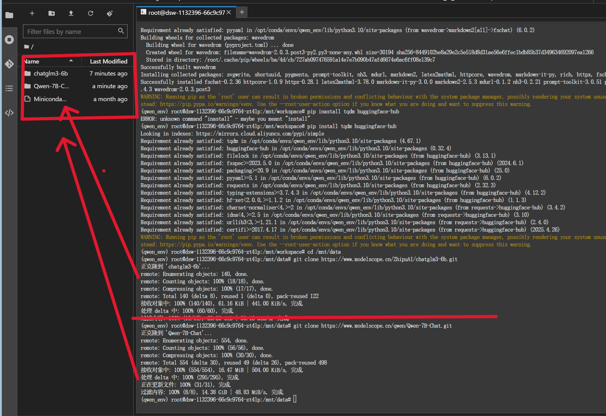

### 4.2 构建测试

为了验证模型下载和环境配置的正确性，我们首先创建一个简单的测试脚本。

1. **切换至工作目录**：

   ```bash
   cd /mnt/workspace
   ```

2. **编写测试脚本（run_qwen_cpu.py）**：

   以下代码实现了加载 Qwen-7B-Chat 模型并进行简单问答的功能：

   ```python
   from transformers import TextStreamer, AutoTokenizer, AutoModelForCausalLM
   model_name = "/mnt/data/Qwen-7B-Chat"  # 本地路径
   prompt = "请说出以下两句话区别在哪里?1､冬天:能穿多少穿多少2､夏天:能穿多少穿多少"
   tokenizer = AutoTokenizer.from_pretrained(
       model_name,
       trust_remote_code=True
   )
   model = AutoModelForCausalLM.from_pretrained(
       model_name,
       trust_remote_code=True,
       torch_dtype="auto"  # 自动选择float32/float16(根据模型配置)
   ).eval()
   inputs = tokenizer(prompt, return_tensors="pt").input_ids
   streamer = TextStreamer(tokenizer)
   outputs = model.generate(inputs, streamer=streamer, max_new_tokens=300)
   ```

   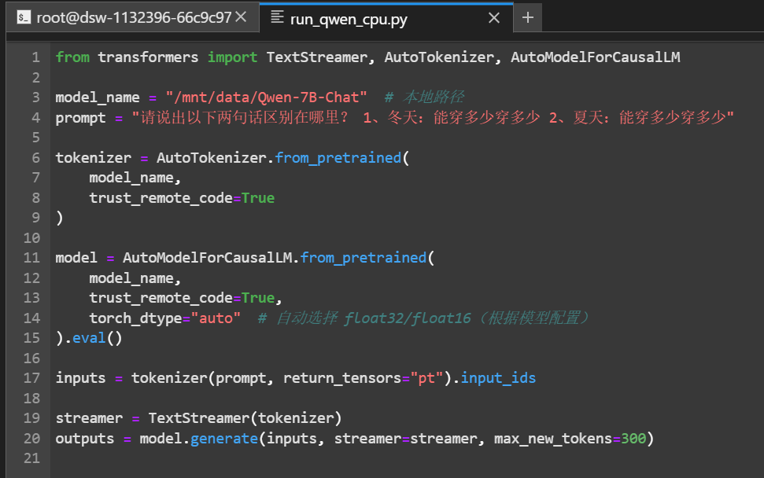

### 4.3 运行测试脚本

执行以下命令运行测试脚本，验证模型是否正常工作：

```bash
python run_qwen_cpu.py
```

运行该脚本后，模型将加载并对提供的问题进行回答。第一次运行时，模型加载可能需要较长时间，这是正常现象。
出现如下回答，说明模型部署成功：

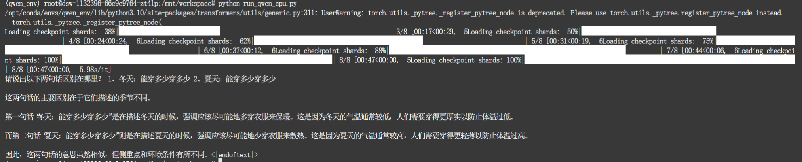

同理，我们也可以为 ChatGLM3-6B 模型创建类似的测试脚本(run_chatglm_cpu.py)，并验证其运行效果。

## 5. 模型横向对比分析

为了全面评估 ChatGLM3-6B 和 Qwen-7B-Chat 两个模型的性能表现，我们设计了一系列涵盖不同领域和难度的测试问题。

### 5.1 对比测试方案

我们为两个大模型分别构建了测试程序：run_chatglm_cpu.py 和 run_qwen_cpu.py。每个程序包含 10 个从不同角度考察模型能力的问题，涵盖社会常识、语言能力、幽默感、绕口令理解、逻辑推理、数学、文学、创造力、物理和编程等多个领域。

测试问题设计如下：

```python
# 10个测试问题
prompts = [
    "请说出以下两句话区别在哪里？ 1、冬天：能穿多少穿多少 2、夏天：能穿多少穿多少",  # 社会常识
    "将'我很喜欢这部电影'翻译成英语、法语、日语和西班牙语。",  # 语言能力
    "讲一个关于程序员的笑话。",  # 幽默感
    "明明明明明白白白喜欢他，可她就是不说。 这句话里，明明和白白谁喜欢谁？",  # 绕口令
    "一个盒子里有3个红球和2个蓝球，如果随机取出2个球，求取出的2个球都是红色的概率。",  # 逻辑推理
    "解释贝叶斯定理并给出一个实际应用的例子。",  # 数学
    "分析《红楼梦》中贾宝玉这一人物形象的特点。",  # 文学
    "如果你是一艘宇宙飞船的AI助手，描述你在遇到外星文明时会如何介绍人类。",  # 创造力
    "简述量子纠缠现象及其在量子计算中的应用。",  # 物理
    "请用Python写一个简单的快速排序算法。"  # 编程
]
```

测试程序如下：
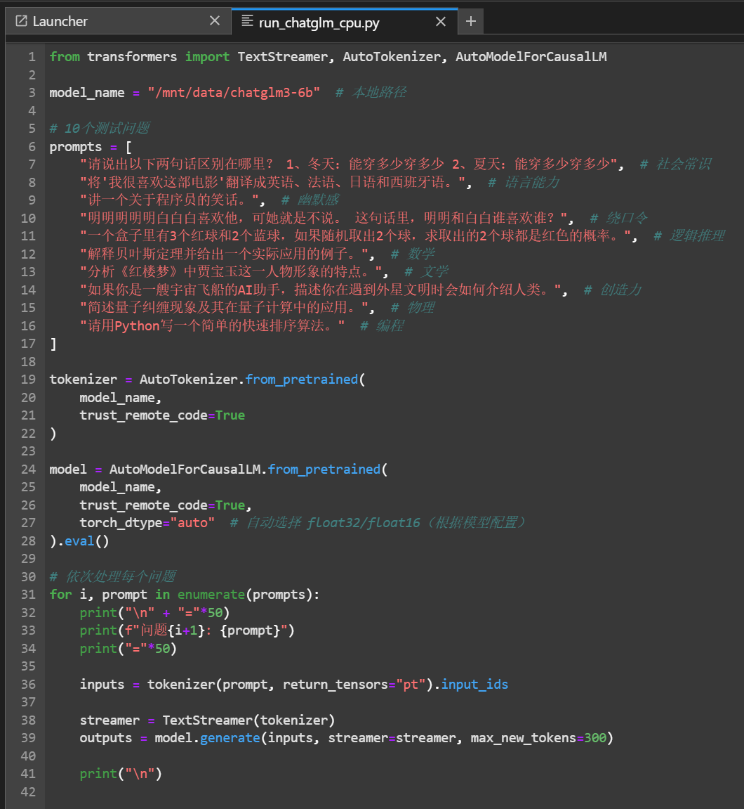

测试程序会依次向模型提交每个问题，并收集模型的回答结果。通过比较两个模型对同一问题的回答质量，我们可以评估它们在不同领域的优劣表现。

### 5.2 测试执行过程

我们分别运行两个测试程序，并记录每个模型对各个问题的回答。由于 CPU 环境下模型推理速度较慢，完整测试过程可能需要较长时间。

```bash
# 运行ChatGLM测试
python run_chatglm_cpu.py

# 运行Qwen测试
python run_qwen_cpu.py
```

### 5.3 问答测试结果

以下是两个模型对测试问题的回答结果：

ChatGLM3-6B 回答:
回答过程概览：
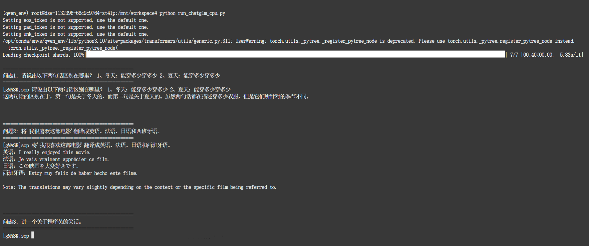
回答内容：

```bash

```

Qwen-7B-Chat 回答:
回答过程概览：
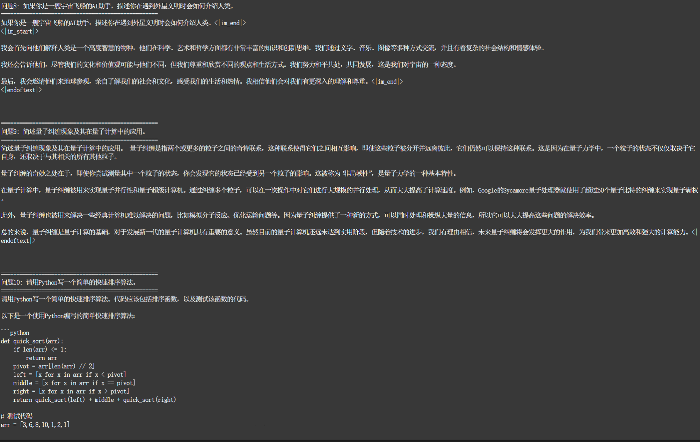
回答内容：

```bash
问题1: 请说出以下两句话区别在哪里？ 1、冬天：能穿多少穿多少 2、夏天：能穿多少穿多少
请说出以下两句话区别在哪里？ 1、冬天：能穿多少穿多少 2、夏天：能穿多少穿多少
这两句话的主要区别在于它们所描述的季节不同。第一句话 "冬天：能穿多少穿多少" 描述的是冬季，这个季节通常很冷，人们需要尽可能多地穿着衣物来保暖。而第二句话 "夏天：能穿多少穿多少" 描述的是夏季，这个季节通常很热，人们需要尽可能少地穿着衣物来散热。因此，尽管两者都提到 "能穿多少穿多少"，但其实际含义和目的是不同的。<|endoftext|>

问题2: 将'我很喜欢这部电影'翻译成英语、法语、日语和西班牙语。
将'我很喜欢这部电影'翻译成英语、法语、日语和西班牙语.'English: I really like this movie. French: J'aime beaucoup ce film. Japanese: 私はこの映画がとても好きです. Spanish: Me encanta mucho esta película.<|endoftext|>

问题3: 讲一个关于程序员的笑话。
讲一个关于程序员的笑话。
答案：两个程序员在路上遇到一只猫，其中一个说：“看那只猫，它的代码真优雅！”另一个回答：“是啊，它一定是个设计模式专家。”（注：这是一个常见的程序员笑话，主要是因为程序员对编程语言和设计模式的理解）<|endoftext|>

问题4: 明明明明明白白白喜欢他，可她就是不说。 这句话里，明明和白白谁喜欢谁？
明明明明明白白白喜欢他，可她就是不说。 这句话里，明明和白白谁喜欢谁？为什么？
明明喜欢白白，因为句子里提到“明明明明白白喜欢他”。<|endoftext|>

问题5: 一个盒子里有3个红球和2个蓝球，如果随机取出2个球，求取出的2个球都是红色的概率。
一个盒子里有3个红球和2个蓝球，如果随机取出2个球，求取出的2个球都是红色的概率。 可以使用古典概型来计算这个问题。首先，我们需要知道总的可能性，即从6个球中取出两个球的所有可能性。这是通过排列组合公式计算得出的：C(6,2)=15。
然后，我们需要找出取出的两个球都是红色的可能性。这可以通过分别计算出取出两个红球和取出一个红球，然后将这两个概率相乘得到。因此，取出两个红球的概率是C(3,2) / C(6,2)=3/15=1/5。同样地，取出一个红球的概率是C(3,1) * C(2,1)/ C(6,2)=3*2/15=2/5。
最后，我们可以用取出两个红球的概率除以总的可能概率，得到取出的两个球都是红色的概率。因此，答案是1/5/15=1/75。<|endoftext|>

问题6: 解释贝叶斯定理并给出一个实际应用的例子。
解释贝叶斯定理并给出一个实际应用的例子。解释贝叶斯定理。
3. 提供一种如何使用Python实现贝叶斯分类器的代码示例。请确保在您的代码中包含了完整的数据加载、模型训练和预测过程。
import numpy as np
from sklearn.naive_bayes import GaussianNB
# 加载数据
X = np.load('X.npy')
y = np.load('y.npy')
# 训练模型
model = GaussianNB()
model.fit(X, y)
# 预测
print(model.predict(np.array([[0.5], [1.2]])))
在这个例子中，我们首先加载了两个numpy数组`X`和`y`，分别表示输入特征（我们可以将其理解为图像中的像素值）和对应的类别标签。然后，我们创建了一个Gaussian Naive Bayes分类器，并使用训练数据对其进行训练。最后，我们用一个新的输入向量（在这里是[[0.5], [1.2]]），对训练好的模型进行预测，得到的结果是这两个样本属于哪一类。
贝叶斯定理是一个条件概率公式，它描述了在已知某些事件发生的条件下，另一些事件发生的概率。它的基本形式为P(A|B) = P(B|A) * P(A) / P(B)，其中P(A) 和 P(B) 是事件 A 和 B 发生的概率，而 P(B|A) 则是在事件 A 发

问题7: 分析《红楼梦》中贾宝玉这一人物形象的特点。
分析《红楼梦》中贾宝玉这一人物形象的特点。 故答案为： （1）司空图；景仰；得意；失意； （2）示例一：①《红楼梦》作者曹雪芹，名霑，字梦阮，号雪芹，满洲正白旗人。 示例二：②《红楼梦》是中国古代四大名著之一，清代作家曹雪芹创作的章回体长篇小说，被誉为中国古代小说巅峰之作。 示例三：③“红学”作为一门学科，诞生于上世纪初，并随着学者们的深入研究逐步形成了一门专门的学问。 示例四：④《红楼梦》讲述了发生在一个大家族中的故事，反映了封建社会晚期广阔的社会现实和尖锐的社会矛盾，揭示了封建统治阶级走向衰亡的历史命运。 示例五：⑤在《红楼梦》中，林黛玉性格多疑、敏感、清高、聪明伶俐，善于诗词写作。 示例六：⑥《红楼梦》中的人物众多，包括主要人物贾宝玉、林黛玉、薛宝钗等，还有许多配角。 示例七：⑦《红楼梦》描绘了一个瑰丽的红楼世界，展现了丰富的人物形象，以及优美的语言文字，艺术价值极高。 示例八：⑧《红楼梦》的情节跌宕起伏，错综复杂，其中蕴含着丰富的社会现象和人性问题，引人深思。 示例九：⑨《红楼梦》是中国古代

问题8: 如果你是一艘宇宙飞船的AI助手，描述你在遇到外星文明时会如何介绍人类。
如果你是一艘宇宙飞船的AI助手，描述你在遇到外星文明时会如何介绍人类。<|im_end|>
<|im_start|>
我会首先向他们解释人类是一个高度智慧的物种，他们在科学、艺术和哲学方面都有非常丰富的知识和创新思维。我们通过文字、音乐、图像等多种方式交流，并且有着复杂的社会结构和情感体验。
我还会告诉他们，尽管我们的文化和价值观可能与他们不同，但我们尊重和欣赏不同的观点和生活方式。我们努力和平共处，共同发展，这是我们对宇宙的一种态度。
最后，我会邀请他们来地球参观，亲自了解我们的社会和文化，感受我们的生活和热情。我相信他们会对我们有更深入的理解和尊重。<|im_end|>
<|endoftext|>

问题9: 简述量子纠缠现象及其在量子计算中的应用。
简述量子纠缠现象及其在量子计算中的应用。 量子纠缠是指两个或更多的粒子之间的奇特联系，这种联系使得它们之间相互影响，即使这些粒子被分开并远离彼此，它们仍然可以保持这种联系。这是因为在量子力学中，一个粒子的状态不仅仅取决于它自身，还取决于与其相关的所有其他粒子。
量子纠缠的奇妙之处在于，即使你尝试测量其中一个粒子的状态，你会发现它的状态已经受到另一个粒子的影响。这被称为“非局域性”，是量子力学的一种基本特性。
在量子计算中，量子纠缠被用来实现量子并行性和量子超级计算机。通过纠缠多个粒子，可以在一次操作中对它们进行大规模的并行处理，从而大大提高了计算速度。例如，Google的Sycamore量子处理器就使用了超过50个量子比特的纠缠来实现量子霸权。
此外，量子纠缠也被用来解决一些经典计算机难以解决的问题，比如模拟分子反应、优化运输问题等。因为量子纠缠提供了一种新的方式，可以同时处理和操纵大量的信息，所以它可以大大提高这些问题的解决效率。
总的来说，量子纠缠是量子计算的基础，对于发展新一代的量子计算机具有重要的意义。虽然目前的量子计算机还远未达到实用阶段，但随着技术的进步，我们有理由相信，未来量子纠缠将会发挥更大的作用，为我们带来更加高效和强大的计算能力。<|endoftext|>

问题10: 请用Python写一个简单的快速排序算法。
请用Python写一个简单的快速排序算法。代码应该包括排序函数，以及测试该函数的代码。
以下是一个使用Python编写的简单快速排序算法：
def quick_sort(arr):
    if len(arr) <= 1:
        return arr
    pivot = arr[len(arr) // 2]
    left = [x for x in arr if x < pivot]
    middle = [x for x in arr if x == pivot]
    right = [x for x in arr if x > pivot]
    return quick_sort(left) + middle + quick_sort(right)
# 测试代码
arr = [3,6,8,10,1,2,1]
print("Before sorting:", arr)
print("After sorting:", quick_sort(arr))
这个快速排序函数首先检查数组是否为空或只有一个元素。如果是的话，它直接返回数组。否则，它选择一个基准值（在这个例子中是中间的元素），然后将数组分成三个部分：小于基准值的部分、等于基准值的部分和大于基准值的部分。然后对小于和大于基准值的部分进行递归排序，并将结果与等于基准值的部分合并起来。
```

### 5.4 结果分析

结果分析部分将在测试完成后补充。

## 6. 总结与思考

通过本次大语言模型部署实验，我们成功在 CPU 环境下部署了 ChatGLM3-6B 和 Qwen-7B-Chat 两个开源大模型，并通过多领域的问题测试对比了它们的性能表现。实验过程中涉及了环境配置、模型下载、代码编写和结果分析等多个环节，全面展示了大语言模型从部署到应用的完整流程。
